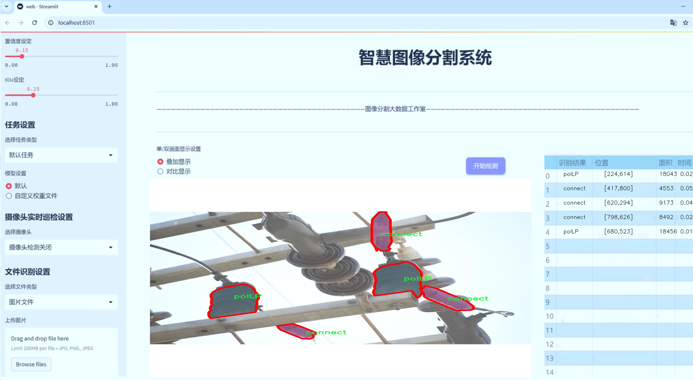
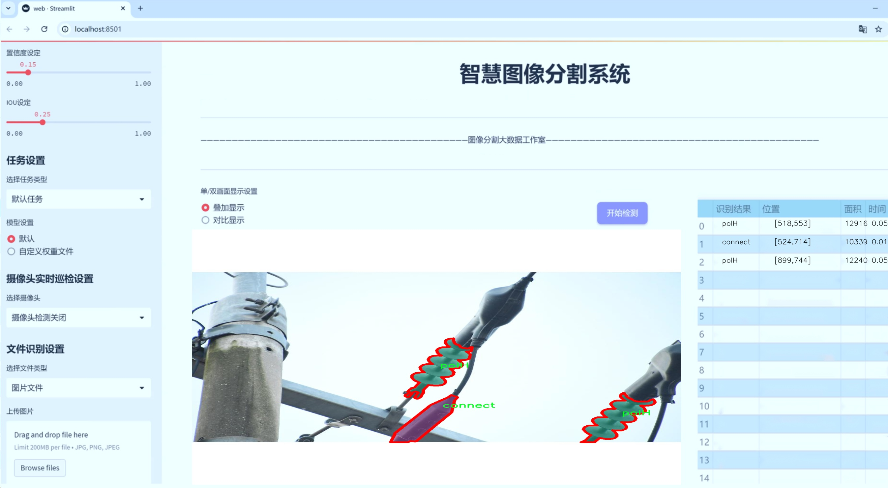
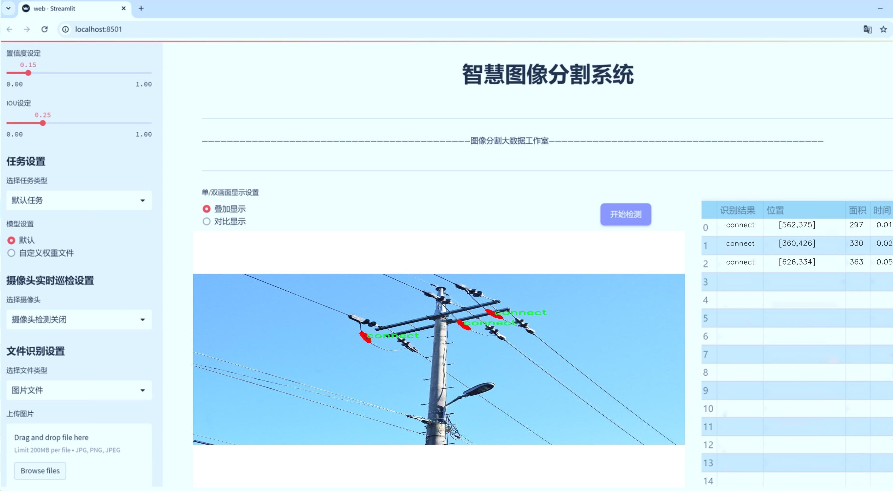
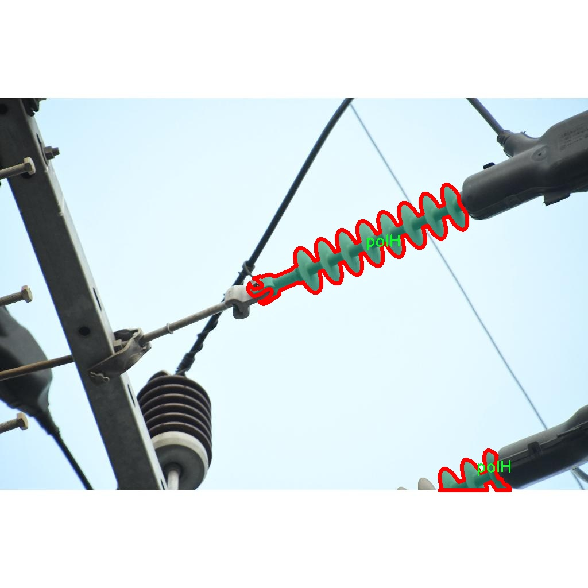
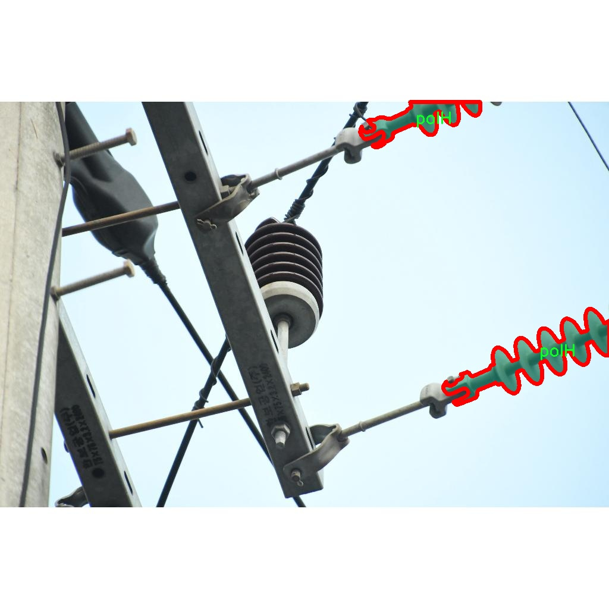
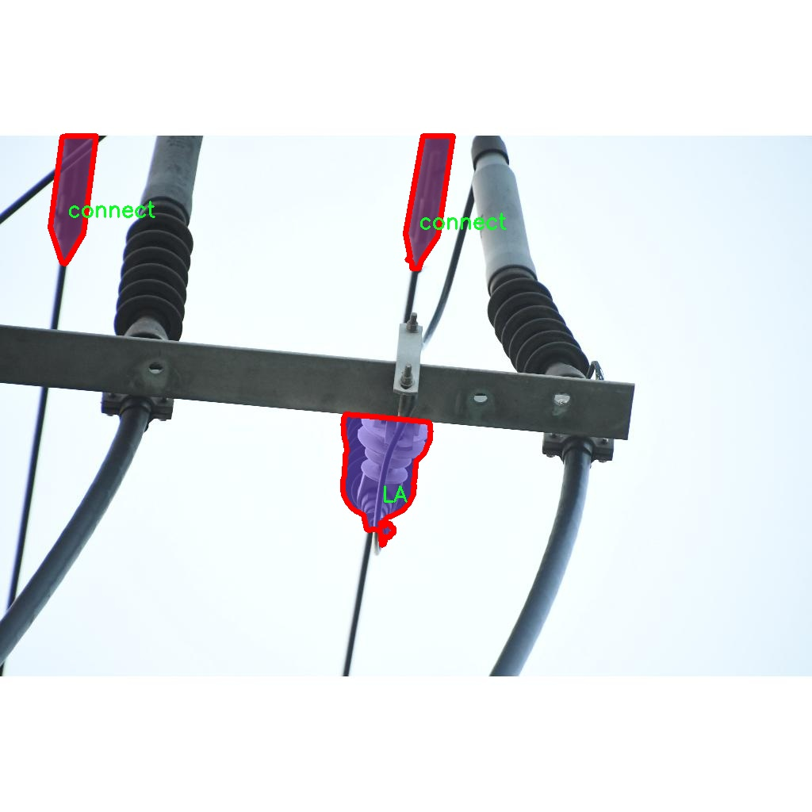
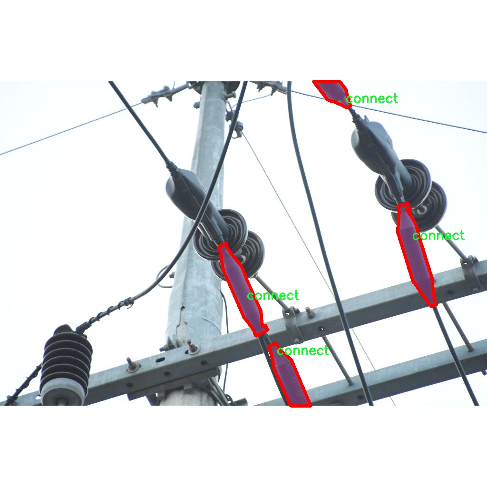
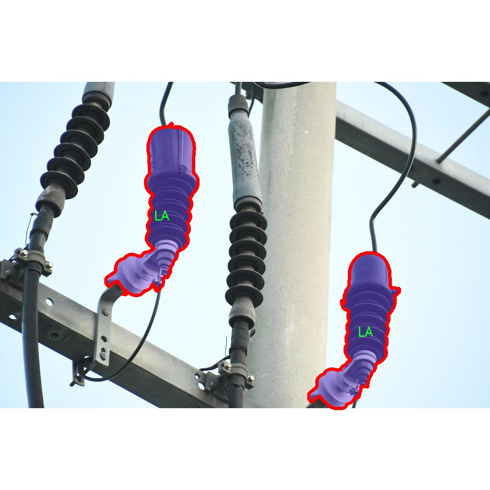

# 电气元件图像分割系统源码＆数据集分享
 [yolov8-seg-C2f-MSBlock＆yolov8-seg-aux等50+全套改进创新点发刊_一键训练教程_Web前端展示]

### 1.研究背景与意义

项目参考[ILSVRC ImageNet Large Scale Visual Recognition Challenge](https://gitee.com/YOLOv8_YOLOv11_Segmentation_Studio/projects)

项目来源[AAAI Global Al lnnovation Contest](https://kdocs.cn/l/cszuIiCKVNis)

研究背景与意义

随着工业自动化和智能制造的迅速发展，电气元件的自动识别与分割技术在电气工程、机器人视觉以及智能监控等领域的应用愈发广泛。传统的电气元件识别方法往往依赖于人工经验，效率低下且容易受到环境因素的影响，无法满足现代工业对高效、准确的要求。因此，基于深度学习的图像分割技术应运而生，成为解决这一问题的重要手段。

YOLO（You Only Look Once）系列模型因其高效的实时检测能力而受到广泛关注。YOLOv8作为该系列的最新版本，结合了更先进的网络结构和训练策略，具备了更强的特征提取能力和更高的检测精度。然而，针对电气元件的图像分割任务，YOLOv8的标准模型仍存在一定的局限性，尤其是在复杂背景下的细粒度分割和小目标检测方面。因此，改进YOLOv8以适应电气元件图像分割的需求，具有重要的研究价值和实际意义。

本研究所使用的数据集包含1100张电气元件的图像，涵盖了五个类别：LA（电缆连接器）、TR（变压器）、connect（连接器）、polH（电源插头）和polLP（低功率插头）。这些类别的电气元件在工业应用中扮演着重要角色，然而，由于其形状、颜色和尺寸的多样性，导致在图像分割过程中面临诸多挑战。通过对这些电气元件进行精确的实例分割，不仅可以提高自动化设备的识别效率，还能为后续的智能决策提供重要的数据支持。

本研究的意义在于，通过改进YOLOv8模型，提升其在电气元件图像分割任务中的表现，推动电气元件自动识别技术的发展。具体而言，研究将探索如何通过数据增强、模型结构优化和损失函数调整等手段，提升模型对复杂背景和小目标的适应能力。同时，基于改进后的模型进行电气元件的实例分割，不仅可以为工业界提供高效的解决方案，还能为相关领域的研究提供新的思路和方法。

此外，本研究还将为电气元件的智能化管理提供基础。随着物联网和智能设备的普及，电气元件的实时监测和管理变得愈加重要。通过实现对电气元件的自动分割和识别，可以为设备的故障诊断、维护管理和性能优化提供有力支持，进而提升整体系统的可靠性和安全性。

综上所述，基于改进YOLOv8的电气元件图像分割系统的研究，不仅具有重要的理论意义，也具备广泛的应用前景。通过深入探索电气元件的图像分割技术，能够为智能制造和工业自动化的发展提供新的动力，推动相关技术的进步与创新。

### 2.图片演示







##### 注意：由于此博客编辑较早，上面“2.图片演示”和“3.视频演示”展示的系统图片或者视频可能为老版本，新版本在老版本的基础上升级如下：（实际效果以升级的新版本为准）

  （1）适配了YOLOV8的“目标检测”模型和“实例分割”模型，通过加载相应的权重（.pt）文件即可自适应加载模型。

  （2）支持“图片识别”、“视频识别”、“摄像头实时识别”三种识别模式。

  （3）支持“图片识别”、“视频识别”、“摄像头实时识别”三种识别结果保存导出，解决手动导出（容易卡顿出现爆内存）存在的问题，识别完自动保存结果并导出到tempDir中。

  （4）支持Web前端系统中的标题、背景图等自定义修改，后面提供修改教程。

  另外本项目提供训练的数据集和训练教程,暂不提供权重文件（best.pt）,需要您按照教程进行训练后实现图片演示和Web前端界面演示的效果。

### 3.视频演示

[3.1 视频演示](https://www.bilibili.com/video/BV13RmNYtEYi/)

### 4.数据集信息展示

##### 4.1 本项目数据集详细数据（类别数＆类别名）

nc: 5
names: ['LA', 'TR', 'connect', 'polH', 'polLP']


##### 4.2 本项目数据集信息介绍

数据集信息展示

在本研究中，我们采用了名为“instance_seg”的数据集，以训练和改进YOLOv8-seg电气元件图像分割系统。该数据集专门针对电气元件的图像分割任务而设计，包含了多种电气元件的实例，旨在提高模型在复杂环境下的分割精度和鲁棒性。数据集的类别数量为五个，具体类别包括：LA（电源线）、TR（变压器）、connect（连接器）、polH（高压电极）和polLP（低压电极）。这些类别的选择反映了电气元件在实际应用中的多样性与复杂性，为模型的训练提供了丰富的样本。

“instance_seg”数据集的构建过程经过精心设计，确保每个类别的样本数量均衡，且涵盖了不同的拍摄角度、光照条件和背景环境。这种多样性不仅增强了数据集的代表性，也为模型在真实场景中的应用奠定了基础。每个类别的图像均经过标注，标注信息包括每个电气元件的边界框和精确的分割掩码，这对于实例分割任务至关重要。通过这些标注，YOLOv8-seg模型能够学习到不同电气元件的特征，从而实现高效的分割。

在数据集的使用过程中，我们特别关注数据的预处理和增强技术，以提高模型的泛化能力。数据增强技术如随机裁剪、旋转、缩放和颜色变换等被广泛应用，以模拟不同的环境条件和拍摄角度。这种方法不仅增加了训练样本的多样性，还有效减少了模型对特定样本的过拟合风险。此外，我们还采用了数据集划分策略，将数据集分为训练集、验证集和测试集，以便在训练过程中监控模型的性能，并进行超参数调优。

在模型训练阶段，我们利用“instance_seg”数据集进行多轮次的训练和验证，实时监测模型在不同类别上的表现。通过分析模型在各个类别上的分割精度，我们能够识别出模型的强项与弱点，从而进一步优化模型结构和训练策略。例如，针对某些类别的分割精度较低的情况，我们可能会增加该类别的样本数量，或采用更为复杂的网络结构，以提升模型的分割能力。

总之，“instance_seg”数据集为电气元件图像分割任务提供了一个坚实的基础。通过对该数据集的深入分析和应用，我们期望能够显著提升YOLOv8-seg模型在电气元件分割任务中的表现，为未来的研究和应用提供有力支持。随着模型性能的不断提高，我们相信该系统将在电气工程、自动化检测等领域发挥重要作用，推动相关技术的发展与应用。











### 5.全套项目环境部署视频教程（零基础手把手教学）

[5.1 环境部署教程链接（零基础手把手教学）](https://www.bilibili.com/video/BV1jG4Ve4E9t/?vd_source=bc9aec86d164b67a7004b996143742dc)


[5.2 安装Python虚拟环境创建和依赖库安装视频教程链接（零基础手把手教学）](https://www.bilibili.com/video/BV1nA4VeYEze/?vd_source=bc9aec86d164b67a7004b996143742dc)

### 6.手把手YOLOV8-seg训练视频教程（零基础小白有手就能学会）

[6.1 手把手YOLOV8-seg训练视频教程（零基础小白有手就能学会）](https://www.bilibili.com/video/BV1cA4VeYETe/?vd_source=bc9aec86d164b67a7004b996143742dc)


按照上面的训练视频教程链接加载项目提供的数据集，运行train.py即可开始训练



     Epoch   gpu_mem       box       obj       cls    labels  img_size
     1/200     0G   0.01576   0.01955  0.007536        22      1280: 100%|██████████| 849/849 [14:42<00:00,  1.04s/it]
               Class     Images     Labels          P          R     mAP@.5 mAP@.5:.95: 100%|██████████| 213/213 [01:14<00:00,  2.87it/s]
                 all       3395      17314      0.994      0.957      0.0957      0.0843

     Epoch   gpu_mem       box       obj       cls    labels  img_size
     2/200     0G   0.01578   0.01923  0.007006        22      1280: 100%|██████████| 849/849 [14:44<00:00,  1.04s/it]
               Class     Images     Labels          P          R     mAP@.5 mAP@.5:.95: 100%|██████████| 213/213 [01:12<00:00,  2.95it/s]
                 all       3395      17314      0.996      0.956      0.0957      0.0845

     Epoch   gpu_mem       box       obj       cls    labels  img_size
     3/200     0G   0.01561    0.0191  0.006895        27      1280: 100%|██████████| 849/849 [10:56<00:00,  1.29it/s]
               Class     Images     Labels          P          R     mAP@.5 mAP@.5:.95: 100%|███████   | 187/213 [00:52<00:00,  4.04it/s]
                 all       3395      17314      0.996      0.957      0.0957      0.0845


### 7.50+种全套YOLOV8-seg创新点代码加载调参视频教程（一键加载写好的改进模型的配置文件）

[7.1 50+种全套YOLOV8-seg创新点代码加载调参视频教程（一键加载写好的改进模型的配置文件）](https://www.bilibili.com/video/BV1Hw4VePEXv/?vd_source=bc9aec86d164b67a7004b996143742dc)

### 8.YOLOV8-seg图像分割算法原理

原始YOLOv8-seg算法原理

YOLOv8-seg算法是2023年由Ultralytics公司推出的YOLO系列中的最新版本，它在YOLOv7的基础上进行了深度优化，旨在提升目标检测和分割的精度与效率。YOLOv8-seg不仅延续了YOLO系列一贯的高效性，还引入了一系列新的技术和结构改进，使其在复杂场景下的表现更加出色。其核心思想是将目标检测与实例分割任务结合，通过一种高效的网络架构来实现对目标的精确定位和分割。

首先，YOLOv8-seg采用了更深的卷积神经网络结构，增强了特征提取的能力。与传统的滑动窗口或区域提议方法不同，YOLOv8-seg直接将整个图像作为输入，通过一个单一的神经网络模型来同时预测目标的位置和类别。这种方法不仅提高了检测的速度，还大幅度提升了检测的精度。YOLOv8-seg的网络结构主要由主干网络（backbone）、特征增强网络（neck）和检测头（head）三部分组成。

在主干网络部分，YOLOv8-seg继续使用CSPDarknet作为基础架构，结合了C2f模块的设计理念。C2f模块通过引入ELAN思想，增加了多个shortcut连接，从而有效缓解了深层网络中的梯度消失问题，增强了特征的重用性。该模块由多个卷积层和Bottleneck结构组成，能够提取出丰富的特征信息，并保持输入输出特征图的尺寸一致。这种设计使得YOLOv8-seg在处理不同尺度的目标时，能够更好地捕捉到细节信息和语义信息的融合。

特征增强网络采用了PAN-FPN结构，旨在实现多尺度特征的深度融合。通过自下而上的高层特征与中层、浅层特征的结合，YOLOv8-seg能够有效整合不同层次的语义信息。这一过程不仅提升了特征的表达能力，还确保了网络在处理小目标时的准确性。特征增强网络的设计使得YOLOv8-seg在面对复杂场景时，能够更好地进行目标检测和分割。

在检测头部分，YOLOv8-seg引入了解耦头的概念，将目标分类和边框回归任务分开处理。这种解耦设计使得每个任务能够更加专注于自身的目标，从而提升了整体的检测精度。YOLOv8-seg采用了Anchor-free的目标检测方法，直接预测目标的位置和大小，而不需要预先定义锚点框。这一创新极大地简化了模型的设计，避免了传统方法中锚点框选择和调整的繁琐过程。

YOLOv8-seg还引入了VFLLoss和DFLLoss+CIoULoss作为损失函数，进一步提升了模型的训练效果。VFLLoss用于分类任务，DFLLoss和CIoULoss则用于边框回归任务，这种组合使得模型在训练过程中能够更好地适应不同类型的样本，尤其是在面对样本不平衡和困难样本时，表现得更加稳健。

在数据预处理方面，YOLOv8-seg采用了YOLOv5的策略，包括马赛克增强、混合增强、空间扰动和颜色扰动等多种增强手段。这些预处理方法能够有效提升模型的泛化能力，使其在不同场景下的表现更加优异。

通过这些创新和改进，YOLOv8-seg在目标检测和实例分割任务中展现出了强大的性能。其高效的检测速度和准确的分割能力，使其在智能监控、自动驾驶、医疗影像分析等多个领域具有广泛的应用前景。总的来说，YOLOv8-seg算法的推出，不仅标志着YOLO系列的又一次技术突破，也为未来的目标检测和分割研究提供了新的思路和方向。


### 9.系统功能展示（检测对象为举例，实际内容以本项目数据集为准）

图9.1.系统支持检测结果表格显示

  图9.2.系统支持置信度和IOU阈值手动调节

  图9.3.系统支持自定义加载权重文件best.pt(需要你通过步骤5中训练获得)

  图9.4.系统支持摄像头实时识别

  图9.5.系统支持图片识别

  图9.6.系统支持视频识别

  图9.7.系统支持识别结果文件自动保存

  图9.8.系统支持Excel导出检测结果数据


### 10.50+种全套YOLOV8-seg创新点原理讲解（非科班也可以轻松写刊发刊，V11版本正在科研待更新）

#### 10.1 由于篇幅限制，每个创新点的具体原理讲解就不一一展开，具体见下列网址中的创新点对应子项目的技术原理博客网址【Blog】：


[10.1 50+种全套YOLOV8-seg创新点原理讲解链接](https://gitee.com/qunmasj/good)

#### 10.2 部分改进模块原理讲解(完整的改进原理见上图和技术博客链接)【如果此小节的图加载失败可以通过CSDN或者Github搜索该博客的标题访问原始博客，原始博客图片显示正常】
### 可变性卷积DCN简介
卷积神经网络由于其构建模块中固定的几何结构，本质上受限于模型几何变换。为了提高卷积神经网络的转换建模能力，《Deformable Convolutional Networks》作者提出了两个模块：可变形卷积（deformable convolution）和可变形RoI池（deformable RoI pooling）。这两个模块均基于用额外的偏移来增加模块中的空间采样位置以及从目标任务中学习偏移的思想，而不需要额外的监督。

第一次证明了在深度神经网络中学习密集空间变换（dense spatial transformation）对于复杂的视觉任务是有效的

视觉识别中的一个关键挑战是如何适应对象比例、姿态、视点和零件变形中的几何变化或模型几何变换。一般有两种方法实现：
1）建立具有足够期望变化的训练数据集。这通常通过增加现有的数据样本来实现，例如通过仿射变换。但是训练成本昂贵而且模型参数庞大。
2）使用变换不变（transformation-invariant）的特征和算法。比如比较有名的SIFT(尺度不变特征变换)便是这一类的代表算法。

但以上的方法有两个缺点：
1）几何变换被假定为固定的和已知的，这些先验知识被用来扩充数据，设计特征和算法。为此，这个假设阻止了对具有未知几何变换的新任务的推广，从而导致这些几何变换可能没有被正确建模。
2）对于不变特征和算法进行手动设计，对于过于复杂的变换可能是困难的或不可行的。

卷积神经网络本质上局限于模拟大型未知转换。局限性源于CNN模块的固定几何结构：卷积单元在固定位置对输入特征图进行采样；池化层以固定比率降低特征矩阵分辨率；RoI（感兴趣区域）池化层将RoI分成固定的空间箱（spatial bins）等。缺乏处理几何变换的内部机制。

这种内部机制的缺乏会导致一些问题，举个例子。同一个CNN层中所有激活单元的感受野大小是相同的，但是这是不可取的。因为不同的位置可能对应于具有不同尺度或变形的对象，所以尺度或感受野大小的自适应确定对于具有精细定位的视觉识别是渴望的。

对于这些问题，作者提出了两个模块提高CNNs对几何变换建模的能力。


deformable convolution（可变形卷积）
将2D偏移量添加到标准卷积中的常规网格采样位置，使得采样网格能够自由变形。通过额外的卷积层，从前面的特征映射中学习偏移。因此，变形采用局部、密集和自适应的方式取决于输入特征。


deformable RoI pooling（可变形RoI池化）
为先前RoI池化的常规库（bin）分区中的每个库位置（bin partition）增加了一个偏移量。类似地，偏移是从前面的特征图和感兴趣区域中学习的，从而能够对具有不同形状的对象进行自适应部件定位（adaptive part localization）。

#### Deformable Convolutional Networks
Deformable Convolution
2D卷积由两个步骤组成：
1）在输入特征图x xx上使用规则网格R RR进行采样。
2）把这些采样点乘不同权重w ww后相加。

网格R定义感受野大小和扩张程度，比如内核大小为3x3，扩张程度为1的网格R可以表示为：
R = { ( − 1 , − 1 ) , ( − 1 , 0 ) , … , ( 0 , 1 ) , ( 1 , 1 ) } R = \{(-1,-1),(-1,0),\dots,(0,1),(1,1)\}
R={(−1,−1),(−1,0),…,(0,1),(1,1)}

​
 一般为小数，使用双线性插值进行处理。（把小数坐标分解到相邻的四个整数坐标点来计算结果）


具体操作如图所示：


首先对输入特征层进行一个普通的3x3卷积处理得到偏移域（offset field）。偏移域特征图具有与输入特征图相同的空间分辨率，channels维度2N对应于N个2D（xy两个方向）偏移。其中的N是原输入特征图上所具有的N个channels，也就是输入输出channels保持不变，这里xy两个channels分别对输出特征图上的一个channels进行偏移。确定采样点后就通过与相对应的权重w点乘相加得到输出特征图上该点最终值。

前面也提到过，由于这里xy两个方向所训练出来的偏移量一般来说是一个小数，那么为了得到这个点所对应的数值，会采用双线性插值的方法，从最近的四个邻近坐标点中计算得到该偏移点的数值，公式如下：


具体推理过程见：双线性插值原理

#### Deformable RoI Poolingb
所有基于区域提议（RPN）的对象检测方法都使用RoI池话处理，将任意大小的输入矩形区域转换为固定大小的特征图。


 一般为小数，需要使用双线性插值进行处理。


具体操作如图所示：


当时看这个部分的时候觉得有些突兀，明明RoI池化会将特征层转化为固定尺寸的区域。其实，我个人觉得，这个部分与上述的可变性卷积操作是类似的。这里同样是使用了一个普通的RoI池化操作，进行一些列处理后得到了一个偏移域特征图，然后重新作用于原来的w × H w \times Hw×H的RoI。只不过这里不再是规律的逐行逐列对每个格子进行池化，而是对于格子进行偏移后再池化处理。

#### Postion﹣Sensitive RoI Pooling
除此之外，论文还提出一种PS RoI池化（Postion﹣Sensitive RoI Pooling）。不同于上述可变形RoI池化中的全连接过程，这里使用全卷积替换。

具体操作如图所示：


首先，对于原来的特征图来说，原本是将输入特征图上的RoI区域分成k × k k\times kk×k个bin。而在这里，则是将输入特征图进行卷积操作，分别得到一个channels为k 2 ( C + 1 ) k^{2}(C+1)k (C+1)的得分图（score maps）和一个channels为2 k 2 ( C + 1 ) 2k{2}(C+1)2k 2 (C+1)的偏移域（offset fields），这两个特征矩阵的宽高是与输入特征矩阵相同的。其中，得分图的channels中，k × k k \times kk×k分别表示的是每一个网格，C CC表示的检测对象的类别数目，1表示背景。而在偏移域中的2表示xy两个方向的偏移。
也就是说，在PS RoI池化中，对于RoI的每一个网格都独自占一个通道形成一层得分图，然后其对于的偏移量占两个通道。offset fields得到的偏移是归一化后的偏移，需要通过和deformable RoI pooling中一样的变换方式得到∆ p i j ∆p_{ij}∆p ij，然后对每层得分图进行偏移池化处理。最后处理完的结果就对应着最后输出的一个网格。所以其包含了位置信息。

原文论述为：


#### Understanding Deformable ConvNets
当可变形卷积叠加时，复合变形的效果是深远的。如图所示：


ps：a是标准卷积的固定感受野，b是可变形卷积的适应性感受野。

感受野和标准卷积中的采样位置在整个顶部特征图上是固定的(左)。在可变形卷积中，它们根据对象的比例和形状进行自适应调整(右)。


### 11.项目核心源码讲解（再也不用担心看不懂代码逻辑）

#### 11.1 ui.py

以下是对给定代码的核心部分进行提炼和详细注释的版本：

```python
import sys
import subprocess

def run_script(script_path):
    """
    使用当前 Python 环境运行指定的脚本。

    Args:
        script_path (str): 要运行的脚本路径

    Returns:
        None
    """
    # 获取当前 Python 解释器的路径
    python_path = sys.executable

    # 构建运行命令，使用 streamlit 运行指定的脚本
    command = f'"{python_path}" -m streamlit run "{script_path}"'

    # 执行命令，并等待其完成
    result = subprocess.run(command, shell=True)
    
    # 检查命令执行结果，如果返回码不为0，则表示出错
    if result.returncode != 0:
        print("脚本运行出错。")

# 主程序入口
if __name__ == "__main__":
    # 指定要运行的脚本路径
    script_path = "web.py"  # 这里可以直接指定脚本名，假设在当前目录下

    # 调用函数运行脚本
    run_script(script_path)
```

### 代码注释说明：

1. **导入模块**：
   - `sys`：用于访问与 Python 解释器紧密相关的变量和函数。
   - `subprocess`：用于执行外部命令和程序。

2. **`run_script` 函数**：
   - 接受一个参数 `script_path`，表示要运行的 Python 脚本的路径。
   - 使用 `sys.executable` 获取当前 Python 解释器的路径，以确保使用正确的 Python 环境。
   - 构建一个命令字符串，使用 `streamlit` 模块运行指定的脚本。
   - 使用 `subprocess.run` 执行构建的命令，并等待其完成。
   - 检查命令的返回码，如果不为0，打印错误信息。

3. **主程序入口**：
   - 使用 `if __name__ == "__main__":` 确保该代码块仅在脚本作为主程序运行时执行。
   - 指定要运行的脚本路径（这里假设 `web.py` 在当前目录下）。
   - 调用 `run_script` 函数来执行指定的脚本。 

这样提炼后的代码保留了核心功能，并且通过注释详细解释了每个部分的作用。

这个程序文件 `ui.py` 是一个用于运行指定 Python 脚本的简单工具，主要依赖于 `subprocess` 模块来执行命令行操作。首先，程序导入了必要的模块，包括 `sys`、`os` 和 `subprocess`，以及一个自定义的 `abs_path` 函数，用于获取文件的绝对路径。

在 `run_script` 函数中，程序接收一个参数 `script_path`，该参数是要运行的 Python 脚本的路径。函数内部首先获取当前 Python 解释器的路径，存储在 `python_path` 变量中。接着，构建一个命令字符串，格式为 `"{python_path}" -m streamlit run "{script_path}"`，这个命令会使用当前的 Python 环境来运行 `streamlit` 模块，并执行指定的脚本。

然后，使用 `subprocess.run` 方法执行构建好的命令。这个方法会在一个新的 shell 中运行命令，并等待其完成。如果命令执行的返回码不为零，表示脚本运行出错，程序会打印出相应的错误信息。

在文件的最后部分，使用 `if __name__ == "__main__":` 语句来确保只有在直接运行该脚本时才会执行以下代码。此处，指定了要运行的脚本路径 `web.py`，并调用 `run_script` 函数来执行它。

总的来说，这个文件的主要功能是通过 `streamlit` 模块运行一个名为 `web.py` 的 Python 脚本，提供了一种简单的方式来启动一个基于 Streamlit 的 Web 应用。

#### 11.2 ultralytics\models\nas\__init__.py

以下是代码中最核心的部分，并附上详细的中文注释：

```python
# 导入必要的模块和类
from .model import NAS  # 从当前包的model模块中导入NAS类
from .predict import NASPredictor  # 从当前包的predict模块中导入NASPredictor类
from .val import NASValidator  # 从当前包的val模块中导入NASValidator类

# 定义模块的公开接口
__all__ = 'NASPredictor', 'NASValidator', 'NAS'  # 指定当使用from module import *时，公开的类和函数
```

### 注释说明：
1. **导入模块**：
   - `from .model import NAS`：从当前包的`model`模块中导入`NAS`类，`NAS`可能是一个与神经架构搜索（Neural Architecture Search）相关的模型。
   - `from .predict import NASPredictor`：从当前包的`predict`模块中导入`NASPredictor`类，`NASPredictor`可能用于对输入数据进行预测。
   - `from .val import NASValidator`：从当前包的`val`模块中导入`NASValidator`类，`NASValidator`可能用于验证模型的性能。

2. **定义公开接口**：
   - `__all__`：这是一个特殊变量，用于定义模块的公共接口。当使用`from module import *`时，只有在`__all__`中列出的名称会被导入。这有助于控制模块的可见性和使用。这里公开了`NASPredictor`、`NASValidator`和`NAS`这三个类。

这个程序文件是Ultralytics YOLO项目中的一个初始化文件，位于`ultralytics\models\nas\__init__.py`。该文件的主要功能是导入和组织与神经架构搜索（NAS）相关的模块和类，以便在其他地方使用时能够方便地引用。

首先，文件顶部的注释部分提到这是Ultralytics YOLO项目的一部分，并且该项目遵循AGPL-3.0许可证。这表明该代码是开源的，用户可以自由使用和修改，但需要遵循相应的许可证条款。

接下来，文件通过`from .model import NAS`语句导入了`model`模块中的`NAS`类。这个类可能是实现神经架构搜索的核心功能，负责定义和训练神经网络架构。

然后，文件通过`from .predict import NASPredictor`导入了`predict`模块中的`NASPredictor`类。这个类可能用于对使用NAS训练得到的模型进行预测，提供了模型推理的功能。

接着，文件通过`from .val import NASValidator`导入了`val`模块中的`NASValidator`类。这个类可能用于验证和评估使用NAS训练得到的模型的性能，确保模型在不同数据集上的表现。

最后，`__all__`变量被定义为一个元组，包含了`'NASPredictor'`、`'NASValidator'`和`'NAS'`。这个变量的作用是指明当使用`from module import *`语句时，哪些名称会被导入。这是一种控制模块公共接口的方式，确保用户只访问到预期的类和功能。

总体来说，这个初始化文件的作用是整合和简化与NAS相关的功能模块，使得在其他部分的代码中可以更方便地使用这些功能。

#### 11.3 ultralytics\solutions\object_counter.py

以下是代码中最核心的部分，并附上详细的中文注释：

```python
from collections import defaultdict
import cv2
from shapely.geometry import Polygon
from shapely.geometry.point import Point

class ObjectCounter:
    """一个用于管理实时视频流中基于轨迹的物体计数的类。"""

    def __init__(self):
        """初始化计数器，设置各种跟踪和计数参数的默认值。"""
        self.reg_pts = None  # 计数区域的点
        self.counting_region = None  # 计数区域的多边形
        self.in_counts = 0  # 进入计数
        self.out_counts = 0  # 离开计数
        self.counting_list = []  # 计数列表
        self.track_history = defaultdict(list)  # 轨迹历史
        self.track_thickness = 2  # 轨迹线的厚度
        self.draw_tracks = False  # 是否绘制轨迹

    def set_args(self, classes_names, reg_pts, region_color=None, line_thickness=2, track_thickness=2, view_img=False, draw_tracks=False):
        """
        配置计数器的图像、边界框线厚度和计数区域点。

        Args:
            classes_names (dict): 类别名称
            reg_pts (list): 定义计数区域的初始点列表
            region_color (tuple): 区域线的颜色
            line_thickness (int): 边界框的线厚度
            track_thickness (int): 轨迹的厚度
            view_img (bool): 控制是否显示视频流的标志
            draw_tracks (bool): 是否绘制轨迹
        """
        self.reg_pts = reg_pts  # 设置计数区域的点
        self.counting_region = Polygon(self.reg_pts)  # 创建计数区域的多边形
        self.names = classes_names  # 设置类别名称
        self.track_thickness = track_thickness  # 设置轨迹厚度
        self.draw_tracks = draw_tracks  # 设置是否绘制轨迹

    def extract_and_process_tracks(self, tracks):
        """
        提取和处理物体轨迹。

        Args:
            tracks (list): 从物体跟踪过程中获得的轨迹列表。
        """
        boxes = tracks[0].boxes.xyxy.cpu()  # 获取边界框坐标
        clss = tracks[0].boxes.cls.cpu().tolist()  # 获取类别
        track_ids = tracks[0].boxes.id.int().cpu().tolist()  # 获取轨迹ID

        for box, track_id, cls in zip(boxes, track_ids, clss):
            # 计算物体的中心点
            track_line = self.track_history[track_id]
            track_line.append((float((box[0] + box[2]) / 2), float((box[1] + box[3]) / 2)))
            track_line.pop(0) if len(track_line) > 30 else None  # 限制轨迹长度

            # 计数物体
            if self.counting_region.contains(Point(track_line[-1])):  # 检查物体是否在计数区域内
                if track_id not in self.counting_list:  # 如果该物体未被计数
                    self.counting_list.append(track_id)  # 添加到计数列表
                    if box[0] < self.counting_region.centroid.x:  # 判断物体是进入还是离开
                        self.out_counts += 1  # 离开计数加1
                    else:
                        self.in_counts += 1  # 进入计数加1

    def start_counting(self, im0, tracks):
        """
        启动物体计数过程的主函数。

        Args:
            im0 (ndarray): 当前视频流的帧。
            tracks (list): 从物体跟踪过程中获得的轨迹列表。
        """
        self.im0 = im0  # 存储当前帧
        if tracks[0].boxes.id is None:  # 如果没有检测到物体
            return
        self.extract_and_process_tracks(tracks)  # 提取和处理轨迹
```

### 代码说明：
1. **ObjectCounter类**：该类用于实时视频流中物体的计数和轨迹管理。
2. **__init__方法**：初始化计数器的属性，包括计数区域、计数值、轨迹历史等。
3. **set_args方法**：配置计数器的参数，包括类别名称、计数区域点、颜色、线厚度等。
4. **extract_and_process_tracks方法**：处理物体的轨迹，更新计数值，并根据物体的位置判断其是进入还是离开计数区域。
5. **start_counting方法**：主函数，开始计数过程，处理每一帧图像和对应的轨迹数据。

这个程序文件定义了一个名为 `ObjectCounter` 的类，主要用于在实时视频流中对物体进行计数。该类通过跟踪物体的运动轨迹，判断物体是否进入或离开指定的计数区域，从而实现计数功能。

在类的初始化方法 `__init__` 中，设置了一些默认值，包括鼠标事件的状态、计数区域的信息、图像和注释的信息、物体计数的信息以及轨迹的信息。特别地，`self.track_history` 使用 `defaultdict` 来存储每个物体的运动轨迹，方便后续的处理。

`set_args` 方法用于配置计数器的参数，包括类名、计数区域的点、区域颜色、线条厚度等。这些参数将影响后续的物体检测和计数过程。

`mouse_event_for_region` 方法处理鼠标事件，允许用户通过鼠标操作来调整计数区域。当用户按下鼠标左键时，如果鼠标位置接近某个区域点，就会选择该点并允许移动；在鼠标移动时，更新选定点的位置；松开鼠标左键时，结束移动。

`extract_and_process_tracks` 方法是处理物体轨迹的核心。它从输入的 `tracks` 中提取出边界框、类别和轨迹 ID，并使用 `Annotator` 类来绘制边界框和计数区域。该方法还会判断物体是否在计数区域内，并根据物体的运动方向更新进入和离开的计数。

最后，`start_counting` 方法是计数过程的主函数。它接收当前帧图像和物体轨迹，并调用 `extract_and_process_tracks` 方法进行处理。

在文件的最后部分，使用 `if __name__ == '__main__':` 来实例化 `ObjectCounter` 类，这意味着当该文件作为主程序运行时，会创建一个 `ObjectCounter` 对象。

总体而言，这个程序实现了一个简单的物体计数器，能够在视频流中实时跟踪物体并进行计数，具有交互性和可视化功能。

#### 11.4 ultralytics\utils\callbacks\mlflow.py

以下是代码中最核心的部分，并附上详细的中文注释：

```python
from ultralytics.utils import LOGGER, RUNS_DIR, SETTINGS, TESTS_RUNNING, colorstr

try:
    import os

    # 确保在非测试环境下运行，且集成设置已启用
    assert not TESTS_RUNNING or 'test_mlflow' in os.environ.get('PYTEST_CURRENT_TEST', '')  # 不记录pytest
    assert SETTINGS['mlflow'] is True  # 验证集成是否启用
    import mlflow

    # 确保mlflow模块已正确导入
    assert hasattr(mlflow, '__version__')  # 验证包不是目录
    from pathlib import Path
    PREFIX = colorstr('MLflow: ')  # 设置日志前缀

except (ImportError, AssertionError):
    mlflow = None  # 如果导入失败，则mlflow设置为None


def on_pretrain_routine_end(trainer):
    """
    在预训练例程结束时记录训练参数到MLflow。

    该函数根据环境变量和训练器参数设置MLflow日志。它设置跟踪URI、实验名称和运行名称，
    然后在未激活的情况下启动MLflow运行。最后记录训练器的参数。

    参数:
        trainer (ultralytics.engine.trainer.BaseTrainer): 包含要记录的参数和参数的训练对象。

    全局:
        mlflow: 用于记录的mlflow模块。

    环境变量:
        MLFLOW_TRACKING_URI: MLflow跟踪的URI。如果未设置，默认为'runs/mlflow'。
        MLFLOW_EXPERIMENT_NAME: MLflow实验的名称。如果未设置，默认为trainer.args.project。
        MLFLOW_RUN: MLflow运行的名称。如果未设置，默认为trainer.args.name。
    """
    global mlflow

    # 获取跟踪URI，默认值为'runs/mlflow'
    uri = os.environ.get('MLFLOW_TRACKING_URI') or str(RUNS_DIR / 'mlflow')
    LOGGER.debug(f'{PREFIX} tracking uri: {uri}')
    mlflow.set_tracking_uri(uri)

    # 设置实验和运行名称
    experiment_name = os.environ.get('MLFLOW_EXPERIMENT_NAME') or trainer.args.project or '/Shared/YOLOv8'
    run_name = os.environ.get('MLFLOW_RUN') or trainer.args.name
    mlflow.set_experiment(experiment_name)

    mlflow.autolog()  # 启用自动记录
    try:
        # 获取当前活动的运行或启动新的运行
        active_run = mlflow.active_run() or mlflow.start_run(run_name=run_name)
        LOGGER.info(f'{PREFIX}logging run_id({active_run.info.run_id}) to {uri}')
        if Path(uri).is_dir():
            LOGGER.info(f"{PREFIX}view at http://127.0.0.1:5000 with 'mlflow server --backend-store-uri {uri}'")
        LOGGER.info(f"{PREFIX}disable with 'yolo settings mlflow=False'")
        mlflow.log_params(dict(trainer.args))  # 记录训练参数
    except Exception as e:
        LOGGER.warning(f'{PREFIX}WARNING ⚠️ Failed to initialize: {e}\n'
                       f'{PREFIX}WARNING ⚠️ Not tracking this run')


def on_fit_epoch_end(trainer):
    """在每个训练周期结束时记录训练指标到MLflow。"""
    if mlflow:
        # 清理指标名称并记录指标
        sanitized_metrics = {k.replace('(', '').replace(')', ''): float(v) for k, v in trainer.metrics.items()}
        mlflow.log_metrics(metrics=sanitized_metrics, step=trainer.epoch)


def on_train_end(trainer):
    """在训练结束时记录模型工件。"""
    if mlflow:
        # 记录最佳模型的目录
        mlflow.log_artifact(str(trainer.best.parent))  
        # 记录保存目录中的所有其他文件
        for f in trainer.save_dir.glob('*'):
            if f.suffix in {'.png', '.jpg', '.csv', '.pt', '.yaml'}:
                mlflow.log_artifact(str(f))

        mlflow.end_run()  # 结束当前运行
        LOGGER.info(f'{PREFIX}results logged to {mlflow.get_tracking_uri()}\n'
                    f"{PREFIX}disable with 'yolo settings mlflow=False'")


# 定义回调函数
callbacks = {
    'on_pretrain_routine_end': on_pretrain_routine_end,
    'on_fit_epoch_end': on_fit_epoch_end,
    'on_train_end': on_train_end} if mlflow else {}
```

### 代码核心部分解释：
1. **导入必要的模块**：导入了`ultralytics`的工具和`mlflow`模块，用于记录训练过程中的参数和指标。
2. **环境变量和设置的检查**：确保在合适的环境下运行，并且MLflow集成已启用。
3. **`on_pretrain_routine_end`函数**：在预训练结束时记录训练参数，设置跟踪URI、实验名称和运行名称，并启动MLflow运行。
4. **`on_fit_epoch_end`函数**：在每个训练周期结束时记录训练指标。
5. **`on_train_end`函数**：在训练结束时记录模型的工件（如权重文件等）。
6. **回调函数字典**：根据是否成功导入`mlflow`来定义回调函数。

这个程序文件是用于在Ultralytics YOLO框架中实现MLflow日志记录的功能。MLflow是一个开源平台，旨在管理机器学习生命周期，包括实验跟踪、模型管理和部署等。该模块的主要功能是记录训练过程中的各种参数、指标和模型工件。

文件开头部分包含了模块的描述信息，说明了如何设置MLflow的跟踪URI，以及如何通过环境变量自定义日志记录的行为。用户可以通过设置环境变量来指定实验名称和运行名称，或者通过命令行参数进行设置。此外，文件还提供了启动本地MLflow服务器的命令，以及如何终止所有正在运行的MLflow服务器实例的命令。

接下来，程序尝试导入必要的库，并进行一些基本的检查，以确保MLflow模块可用，并且当前不是在运行pytest测试。通过这些检查，程序确保只有在合适的环境下才会进行日志记录。

在`on_pretrain_routine_end`函数中，程序会在预训练例程结束时记录训练参数。它首先根据环境变量或训练器的参数设置跟踪URI、实验名称和运行名称。然后，程序启动一个MLflow运行，并记录训练器的参数。如果在初始化过程中出现异常，程序会记录警告信息，表示未能跟踪该运行。

`on_fit_epoch_end`函数用于在每个训练周期结束时记录训练指标。它会清理指标的名称，并将其记录到MLflow中。

`on_train_end`函数则在训练结束时记录模型工件。它会记录最佳模型的保存目录及其他相关文件（如图像、CSV文件、模型权重等）。最后，程序结束当前的MLflow运行，并记录结果的URI。

最后，程序定义了一个回调字典，包含了在不同训练阶段调用的函数。如果MLflow不可用，则该字典为空。这使得在训练过程中可以灵活地进行日志记录，便于后续的实验分析和模型管理。

#### 11.5 train.py

以下是经过简化和注释的核心代码部分：

```python
import os
import torch
import yaml
from ultralytics import YOLO  # 导入YOLO模型库

if __name__ == '__main__':  # 确保该模块被直接运行时才执行以下代码
    # 设置训练参数
    workers = 1  # 数据加载的工作进程数
    batch = 8  # 每个批次的样本数量
    device = "0" if torch.cuda.is_available() else "cpu"  # 判断是否使用GPU

    # 获取数据集配置文件的绝对路径
    data_path = abs_path(f'datasets/data/data.yaml', path_type='current')  

    # 读取YAML文件，保持原有顺序
    with open(data_path, 'r') as file:
        data = yaml.load(file, Loader=yaml.FullLoader)

    # 修改数据集路径
    if 'train' in data and 'val' in data and 'test' in data:
        directory_path = os.path.dirname(data_path.replace(os.sep, '/'))  # 获取目录路径
        data['train'] = directory_path + '/train'  # 更新训练集路径
        data['val'] = directory_path + '/val'      # 更新验证集路径
        data['test'] = directory_path + '/test'    # 更新测试集路径

        # 将修改后的数据写回YAML文件
        with open(data_path, 'w') as file:
            yaml.safe_dump(data, file, sort_keys=False)

    # 加载YOLO模型
    model = YOLO(r"C:\codeseg\codenew\50+种YOLOv8算法改进源码大全和调试加载训练教程（非必要）\改进YOLOv8模型配置文件\yolov8-seg-C2f-Faster.yaml").load("./weights/yolov8s-seg.pt")

    # 开始训练模型
    results = model.train(
        data=data_path,  # 指定训练数据的配置文件路径
        device=device,  # 指定使用的设备
        workers=workers,  # 指定数据加载的工作进程数
        imgsz=640,  # 输入图像的大小
        epochs=100,  # 训练的轮数
        batch=batch,  # 每个批次的样本数量
    )
```

### 代码注释说明：
1. **导入必要的库**：引入操作系统、PyTorch、YAML解析库和YOLO模型库。
2. **主程序入口**：使用`if __name__ == '__main__':`确保代码仅在直接运行时执行。
3. **设置训练参数**：
   - `workers`：设置数据加载的工作进程数。
   - `batch`：设置每个批次的样本数量。
   - `device`：判断是否使用GPU，若可用则使用GPU，否则使用CPU。
4. **获取数据集配置文件路径**：使用`abs_path`函数获取数据集配置文件的绝对路径。
5. **读取和修改YAML文件**：
   - 读取YAML文件内容。
   - 更新训练、验证和测试集的路径。
   - 将修改后的内容写回YAML文件。
6. **加载YOLO模型**：指定模型配置文件和权重文件，加载YOLO模型。
7. **训练模型**：调用`model.train`方法开始训练，传入训练数据路径、设备、工作进程数、图像大小、训练轮数和批次大小等参数。

这个程序文件 `train.py` 是一个用于训练 YOLO 模型的脚本。首先，它导入了必要的库，包括 `os`、`torch`、`yaml` 和 `ultralytics` 中的 YOLO 模型。此外，还导入了 `QtFusion.path` 中的 `abs_path` 函数用于处理路径，以及 `matplotlib` 用于图形显示。

在 `__main__` 块中，程序首先设置了一些训练参数，包括工作进程数 `workers`、批次大小 `batch` 和设备类型 `device`。设备类型会根据当前是否有可用的 GPU 来决定，如果有则使用 GPU（标记为 "0"），否则使用 CPU。

接下来，程序通过 `abs_path` 函数获取数据集配置文件 `data.yaml` 的绝对路径，并将其转换为 UNIX 风格的路径。然后，它提取出该路径的目录部分，以便后续使用。

程序读取 `data.yaml` 文件，保持原有的顺序，并检查其中是否包含 `train`、`val` 和 `test` 三个键。如果存在，这些键的值会被修改为对应的训练、验证和测试数据的目录路径。修改后的数据会被写回到原来的 YAML 文件中。

在模型加载部分，程序使用指定的配置文件路径加载 YOLO 模型。此处使用的是一个特定的配置文件 `yolov8-seg-C2f-Faster.yaml`，并加载了预训练的权重文件 `yolov8s-seg.pt`。

最后，程序调用 `model.train()` 方法开始训练模型，传入训练数据的配置文件路径、设备类型、工作进程数、输入图像大小（640x640）、训练的 epoch 数（100）以及批次大小（8）等参数。

整体来看，这个脚本的功能是配置并启动 YOLO 模型的训练过程，用户可以根据自己的硬件条件和数据集情况调整相关参数。

#### 11.6 ultralytics\nn\modules\conv.py

以下是经过简化和注释的核心代码部分，主要包含了卷积相关的模块和注意力机制的实现：

```python
import torch
import torch.nn as nn
import math

def autopad(k, p=None, d=1):
    """自动计算填充以保持输出形状与输入相同。"""
    if d > 1:
        k = d * (k - 1) + 1 if isinstance(k, int) else [d * (x - 1) + 1 for x in k]  # 实际的卷积核大小
    if p is None:
        p = k // 2 if isinstance(k, int) else [x // 2 for x in k]  # 自动填充
    return p

class Conv(nn.Module):
    """标准卷积层，包含卷积、批归一化和激活函数。"""
    default_act = nn.SiLU()  # 默认激活函数

    def __init__(self, c1, c2, k=1, s=1, p=None, g=1, d=1, act=True):
        """初始化卷积层，设置输入输出通道、卷积核大小、步幅、填充等参数。"""
        super().__init__()
        self.conv = nn.Conv2d(c1, c2, k, s, autopad(k, p, d), groups=g, dilation=d, bias=False)
        self.bn = nn.BatchNorm2d(c2)  # 批归一化
        self.act = self.default_act if act is True else act if isinstance(act, nn.Module) else nn.Identity()

    def forward(self, x):
        """前向传播：应用卷积、批归一化和激活函数。"""
        return self.act(self.bn(self.conv(x)))

class ChannelAttention(nn.Module):
    """通道注意力模块。"""
    def __init__(self, channels: int) -> None:
        """初始化通道注意力模块，设置池化和全连接层。"""
        super().__init__()
        self.pool = nn.AdaptiveAvgPool2d(1)  # 自适应平均池化
        self.fc = nn.Conv2d(channels, channels, 1, 1, 0, bias=True)  # 全连接卷积
        self.act = nn.Sigmoid()  # 激活函数

    def forward(self, x: torch.Tensor) -> torch.Tensor:
        """前向传播：计算通道注意力并应用于输入。"""
        return x * self.act(self.fc(self.pool(x)))  # 通过池化和全连接层计算注意力

class SpatialAttention(nn.Module):
    """空间注意力模块。"""
    def __init__(self, kernel_size=7):
        """初始化空间注意力模块，设置卷积核大小。"""
        super().__init__()
        assert kernel_size in (3, 7), 'kernel size must be 3 or 7'
        padding = 3 if kernel_size == 7 else 1
        self.cv1 = nn.Conv2d(2, 1, kernel_size, padding=padding, bias=False)  # 卷积层
        self.act = nn.Sigmoid()  # 激活函数

    def forward(self, x):
        """前向传播：计算空间注意力并应用于输入。"""
        return x * self.act(self.cv1(torch.cat([torch.mean(x, 1, keepdim=True), torch.max(x, 1, keepdim=True)[0]], 1)))  # 计算空间注意力

class CBAM(nn.Module):
    """卷积块注意力模块。"""
    def __init__(self, c1, kernel_size=7):
        """初始化CBAM模块，设置输入通道和卷积核大小。"""
        super().__init__()
        self.channel_attention = ChannelAttention(c1)  # 通道注意力
        self.spatial_attention = SpatialAttention(kernel_size)  # 空间注意力

    def forward(self, x):
        """前向传播：依次通过通道注意力和空间注意力。"""
        return self.spatial_attention(self.channel_attention(x))  # 先计算通道注意力，再计算空间注意力
```

### 代码说明：
1. **autopad**：根据卷积核大小和扩张率自动计算填充，以保持输入输出形状一致。
2. **Conv**：标准卷积层，包含卷积操作、批归一化和激活函数，适用于大多数卷积神经网络。
3. **ChannelAttention**：通道注意力模块，通过自适应平均池化和全连接卷积计算通道权重，并将其应用于输入特征图。
4. **SpatialAttention**：空间注意力模块，通过对输入特征图进行平均和最大池化，计算空间注意力权重，并将其应用于输入特征图。
5. **CBAM**：结合通道注意力和空间注意力的模块，先应用通道注意力，再应用空间注意力，增强特征表达能力。

这个程序文件定义了一系列用于卷积操作的模块，主要用于深度学习中的图像处理，特别是在YOLO（You Only Look Once）目标检测模型中。文件中包含多个类，每个类实现了不同类型的卷积操作和相关功能。

首先，文件导入了必要的库，包括`math`、`numpy`和`torch`，并定义了一个名为`autopad`的函数，用于根据卷积核的大小、填充和扩张参数自动计算填充量，以确保输出形状与输入形状相同。

接下来，定义了多个卷积相关的类。`Conv`类实现了标准的卷积操作，包含卷积层、批归一化层和激活函数。其构造函数允许用户指定输入和输出通道数、卷积核大小、步幅、填充、分组、扩张和激活函数。`forward`方法则执行卷积、批归一化和激活操作。

`Conv2`类是`Conv`类的简化版本，增加了一个1x1的卷积层，以便在卷积过程中进行特征融合。它的`forward`方法将两个卷积的输出相加，然后应用激活函数。

`LightConv`类实现了一种轻量级卷积结构，包含两个卷积层，分别为1x1卷积和深度卷积（`DWConv`），用于减少计算量。

`DWConv`类实现了深度卷积，这是一种特殊的卷积形式，它对每个输入通道单独进行卷积操作，从而减少参数数量和计算量。

`ConvTranspose`类实现了转置卷积，用于上采样操作，通常在生成模型或解码器中使用。它也可以选择性地应用批归一化和激活函数。

`Focus`类用于将输入的空间信息聚焦到通道维度，通过对输入张量进行切片和拼接来实现。

`GhostConv`类实现了Ghost卷积，这是一种高效的卷积方法，通过生成更多的特征图来提高模型的表达能力，同时保持计算效率。

`RepConv`类是一个基本的重复卷积模块，支持训练和推理阶段的不同操作。它通过融合多个卷积层的权重来优化模型。

此外，文件中还定义了几个注意力机制模块，包括`ChannelAttention`、`SpatialAttention`和`CBAM`（通道-空间注意力模块），这些模块通过对特征图进行加权来增强模型对重要特征的关注。

最后，`Concat`类用于在指定维度上连接多个张量，通常用于将不同来源的特征图合并，以便后续处理。

整体来看，这个文件实现了多种卷积和注意力机制的模块，为构建复杂的神经网络提供了基础组件，特别适用于目标检测和图像处理任务。

### 12.系统整体结构（节选）

### 整体功能和构架概括

该项目是一个基于Ultralytics YOLO框架的计算机视觉应用，主要用于目标检测和相关任务。项目的结构包括多个模块和文件，每个文件负责特定的功能，整体上形成了一个完整的训练、推理和可视化的工作流。主要功能包括模型的训练、物体计数、卷积操作的实现、日志记录、用户界面、模型的初始化和回调机制等。

- **训练模块**：负责加载数据、配置模型、执行训练过程。
- **模型模块**：定义和管理不同类型的卷积层、注意力机制和模型结构。
- **回调模块**：用于记录训练过程中的各种信息，支持与MLflow和TensorBoard的集成。
- **工具模块**：提供通用的工具函数和类，支持数据处理和模型评估。
- **用户界面**：提供简单的用户交互界面，用于启动和管理训练过程。

### 文件功能整理表

| 文件路径                                          | 功能描述                                                     |
|--------------------------------------------------|------------------------------------------------------------|
| `ui.py`                                         | 提供用户界面，允许用户通过命令行运行指定的Python脚本。       |
| `ultralytics/models/nas/__init__.py`           | 初始化神经架构搜索（NAS）模块，导入相关类和功能。          |
| `ultralytics/solutions/object_counter.py`      | 实现物体计数功能，能够在视频流中实时跟踪和计数物体。        |
| `ultralytics/utils/callbacks/mlflow.py`        | 集成MLflow进行训练过程的日志记录和实验管理。               |
| `train.py`                                      | 配置并启动YOLO模型的训练过程，加载数据和模型配置。         |
| `ultralytics/nn/modules/conv.py`               | 定义多种卷积操作和注意力机制的模块，支持深度学习模型。      |
| `ultralytics/models/sam/__init__.py`           | 初始化SAM（Segment Anything Model）模块，导入相关功能。    |
| `utils.py`                                      | 提供通用的工具函数，支持数据处理和模型评估。                |
| `ultralytics/__init__.py`                       | 初始化Ultralytics包，设置模块的公共接口。                   |
| `ultralytics/trackers/byte_tracker.py`         | 实现字节跟踪器，用于目标跟踪任务。                          |
| `ultralytics/models/utils/ops.py`              | 定义模型操作的辅助函数，支持模型的构建和推理。              |
| `ultralytics/utils/callbacks/base.py`          | 定义回调机制的基础类，支持训练过程中的自定义操作。          |
| `ultralytics/utils/callbacks/tensorboard.py`   | 集成TensorBoard进行训练过程的可视化和日志记录。            |

这个表格总结了项目中各个文件的主要功能，帮助理解整个项目的结构和模块之间的关系。

注意：由于此博客编辑较早，上面“11.项目核心源码讲解（再也不用担心看不懂代码逻辑）”中部分代码可能会优化升级，仅供参考学习，完整“训练源码”、“Web前端界面”和“50+种创新点源码”以“14.完整训练+Web前端界面+50+种创新点源码、数据集获取”的内容为准。

### 13.图片、视频、摄像头图像分割Demo(去除WebUI)代码

在这个博客小节中，我们将讨论如何在不使用WebUI的情况下，实现图像分割模型的使用。本项目代码已经优化整合，方便用户将分割功能嵌入自己的项目中。
核心功能包括图片、视频、摄像头图像的分割，ROI区域的轮廓提取、类别分类、周长计算、面积计算、圆度计算以及颜色提取等。
这些功能提供了良好的二次开发基础。

### 核心代码解读

以下是主要代码片段，我们会为每一块代码进行详细的批注解释：

```python
import random
import cv2
import numpy as np
from PIL import ImageFont, ImageDraw, Image
from hashlib import md5
from model import Web_Detector
from chinese_name_list import Label_list

# 根据名称生成颜色
def generate_color_based_on_name(name):
    ......

# 计算多边形面积
def calculate_polygon_area(points):
    return cv2.contourArea(points.astype(np.float32))

...
# 绘制中文标签
def draw_with_chinese(image, text, position, font_size=20, color=(255, 0, 0)):
    image_pil = Image.fromarray(cv2.cvtColor(image, cv2.COLOR_BGR2RGB))
    draw = ImageDraw.Draw(image_pil)
    font = ImageFont.truetype("simsun.ttc", font_size, encoding="unic")
    draw.text(position, text, font=font, fill=color)
    return cv2.cvtColor(np.array(image_pil), cv2.COLOR_RGB2BGR)

# 动态调整参数
def adjust_parameter(image_size, base_size=1000):
    max_size = max(image_size)
    return max_size / base_size

# 绘制检测结果
def draw_detections(image, info, alpha=0.2):
    name, bbox, conf, cls_id, mask = info['class_name'], info['bbox'], info['score'], info['class_id'], info['mask']
    adjust_param = adjust_parameter(image.shape[:2])
    spacing = int(20 * adjust_param)

    if mask is None:
        x1, y1, x2, y2 = bbox
        aim_frame_area = (x2 - x1) * (y2 - y1)
        cv2.rectangle(image, (x1, y1), (x2, y2), color=(0, 0, 255), thickness=int(3 * adjust_param))
        image = draw_with_chinese(image, name, (x1, y1 - int(30 * adjust_param)), font_size=int(35 * adjust_param))
        y_offset = int(50 * adjust_param)  # 类别名称上方绘制，其下方留出空间
    else:
        mask_points = np.concatenate(mask)
        aim_frame_area = calculate_polygon_area(mask_points)
        mask_color = generate_color_based_on_name(name)
        try:
            overlay = image.copy()
            cv2.fillPoly(overlay, [mask_points.astype(np.int32)], mask_color)
            image = cv2.addWeighted(overlay, 0.3, image, 0.7, 0)
            cv2.drawContours(image, [mask_points.astype(np.int32)], -1, (0, 0, 255), thickness=int(8 * adjust_param))

            # 计算面积、周长、圆度
            area = cv2.contourArea(mask_points.astype(np.int32))
            perimeter = cv2.arcLength(mask_points.astype(np.int32), True)
            ......

            # 计算色彩
            mask = np.zeros(image.shape[:2], dtype=np.uint8)
            cv2.drawContours(mask, [mask_points.astype(np.int32)], -1, 255, -1)
            color_points = cv2.findNonZero(mask)
            ......

            # 绘制类别名称
            x, y = np.min(mask_points, axis=0).astype(int)
            image = draw_with_chinese(image, name, (x, y - int(30 * adjust_param)), font_size=int(35 * adjust_param))
            y_offset = int(50 * adjust_param)

            # 绘制面积、周长、圆度和色彩值
            metrics = [("Area", area), ("Perimeter", perimeter), ("Circularity", circularity), ("Color", color_str)]
            for idx, (metric_name, metric_value) in enumerate(metrics):
                ......

    return image, aim_frame_area

# 处理每帧图像
def process_frame(model, image):
    pre_img = model.preprocess(image)
    pred = model.predict(pre_img)
    det = pred[0] if det is not None and len(det)
    if det:
        det_info = model.postprocess(pred)
        for info in det_info:
            image, _ = draw_detections(image, info)
    return image

if __name__ == "__main__":
    cls_name = Label_list
    model = Web_Detector()
    model.load_model("./weights/yolov8s-seg.pt")

    # 摄像头实时处理
    cap = cv2.VideoCapture(0)
    while cap.isOpened():
        ret, frame = cap.read()
        if not ret:
            break
        ......

    # 图片处理
    image_path = './icon/OIP.jpg'
    image = cv2.imread(image_path)
    if image is not None:
        processed_image = process_frame(model, image)
        ......

    # 视频处理
    video_path = ''  # 输入视频的路径
    cap = cv2.VideoCapture(video_path)
    while cap.isOpened():
        ret, frame = cap.read()
        ......
```


### 14.完整训练+Web前端界面+50+种创新点源码、数据集获取


# [下载链接：https://mbd.pub/o/bread/Zp2XmZdv](https://mbd.pub/o/bread/Zp2XmZdv)